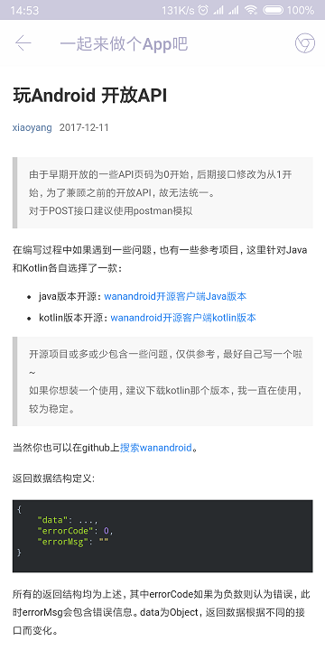

# [WanAndroid](http://www.wanandroid.com)

## WanAndroid Android APP

### 用到的API和第三方包
- [WanAndroid API](http://www.wanandroid.com/blog/show/2)
- [RxJava2](https://github.com/ReactiveX/RxJava)
- [RxAndroid](https://github.com/ReactiveX/RxAndroid)
- [Retrofit2](https://github.com/square/retrofit)
- [Architecture](https://github.com/googlesamples/android-architecture) [MVP-CLEAN](https://github.com/googlesamples/android-architecture/tree/todo-mvp-clean)
- [Banner](https://github.com/youth5201314/banner)
- [Glide](https://github.com/bumptech/glide)
- [Material Design 2](https://material.io)

#### 界面布局

    AppBarLayout(Toolbar) + BottomNavigationView + ViewPager + Fragment

    底栏导航: Home(主页), Hierarchy(体系), Project(项目), Settings(设置)

1. Home

    包含 `Banner` Header 和主页`文章列表`

    

2. Hierarchy

    

3. Project

    

4. Settings

    离线状态:  
    

    在线状态:  
    

5. Login

    包含 `SIGN IN`, `SIGN UP` 和 `Later`  
    SIGN IN:  
    

    SIGN UP:  
    

6. Article

    